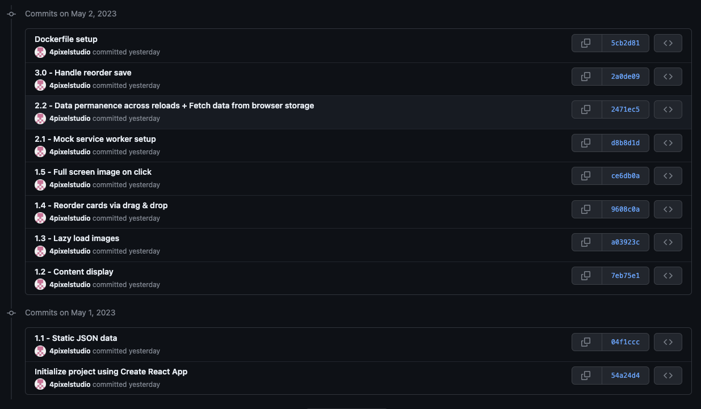

# Task

## Project Setup

<br />

### 1. Using Git

<br />

To set up this project locally on your machine, please follow these steps:

1. Clone the repository to your local machine using the following command:

```bash
git clone https://github.com/4pixelstudio/full-stack-app.git
```

2. Navigate to the project directory:

```bash
cd full-stack-app
```

3. Install project dependencies - Ensure that Node.js is installed on your system:

```bash
npm install
```

4. Start the development server:

```bash
npm start
```

**You can go back to any prior commit to see how that section is progressing.**



<br />

### 2. Using Docker

1. Navigate to the project directory and create a docker image

```bash
docker build -t app .
```

2. Run the Docker Image on port 3000

```bash
docker run -p 3000:3000 app
```

---

## Project Description

<br />

### Part 1: Front-end

<br />

**Folders & Files**

1. data - Static JSON data
2. pages - Full page components
3. components - Reusable components
4. hooks - Custom hooks
5. interfaces - Typescript interfaces / models
6. constants - App constants
7. utils - Utility and helper functions

<br />

**1.1 - Static JSON data**

Static data is stored in data / data.json - Based on the structure of the data, I have defined an interface in interfaces / CardInterface.tsx

<br />

**1.2 - Content Display**

**Components** - DraggableCards.tsx & Card.tsx

Flex is used to display the cards, and each card has a width of 33.33% - the gap between the cards.

Spacing is hardcoded here but we can create a css variable to adjust the spacing in the entire app by modifying the constant.

I have used inline styling for the cards because there were only a few properties to add. However, we can style components using component-specific CSS. I try to keep components within 300-500 LOC.

<br />

**1.3 - Lazy Load Image Component:**

Lazy loading the image with the onLoad event. For the time being, I am only accepting the image's src and alt attributes, but we can make it more generic by allowing other attributes to be provided and setting lazy = false to disable the lazy load functionality.

<br />

**1.4 - Reorder cards via drag & drop**

CardList.tsx has been renamed DraggableCards.tsx, which makes more sense given that we are adding drag and drop capabilities to the cards. Using the 'draggable' attribute to make the cards draggable and handle state updates with onDragStart and onDrop events.

<br />

**1.5 - Full screen image component**

We can add a 'onClick' event listener to each card because we are only displaying 5 cards, but if we are designing something similar to Pinterest, where we have infinite scrolling and a single page can display 100+ images, putting a onClick event on each card is not optimal and memory expensive.

Event delegation is used to have a single onClick event on the parent. If the user clicks on the image element, the handleCardClick method will be called with event propagation, and we will be able to show the modal / full screen image component. **To close the modal, use the escape key or the 'close' text.**

---

<br />

### **Part 2: Mock service worker setup**

_I'm using the MSW package because I mostly worked on the PHP Laravel framework._

Handlers are defined in mocks / handlers.ts

If data has not already been put into the browser's local storage, it will be populated with the key name defined in constants.ts (cards) on app load (App.tsx). The data will be returned from the browser's local storage through the GET API call.

API calls are defined in services / CardService.ts. For now, base url is also a constant in constants.ts but we will use .env file for multiple envs setup.

**SQL CREATE TABLE:**

```sql

CREATE TABLE table (
  id INT AUTO_INCREMENT PRIMARY KEY,
  type VARCHAR(255) NOT NULL,
  title VARCHAR(255) NOT NULL,
  position INT NOT NULL
);
```

---

<br />

### Part 3: API Integration

<br />

On data fetch, I preserve the current order of the cards in originalCardsRef, so that I can compare if I need to call the update API if the order has changed. hasOrderChanged method will compare the current order with the original order.

**Refs for cards and originalCards:**

If we are using setInterval, the callback function forms a closure and captures the initial state values when it is created. If we try to access the state directly inside the callback, we will get outdated values. So, we can either clear and re-create the setInterval function using useEffect’s dependency array or use refs to get the updated state values.

**GET QUERY:**

```sql
SELECT * FROM table ORDER BY position ASC;
```

**RE-ORDER UPDATE:**

On page load, setInterval is configured, and the callback function is called every 5 seconds.

On update, I am replacing the current order with the new order of the data since I am using browser’s localStorage.

For SQL, the following single update query can be used to update the position of the items:

```sql
UPDATE table
SET position = CASE
    WHEN id = 1 THEN 2
    WHEN id = 2 THEN 3
    WHEN id = 3 THEN 0
    -- More conditions as per the updated order
    ELSE position
END
WHERE id IN (1, 2, 3)
```

**Optimistic updates:**

We can rollback the state to the original order if API call to update the new order fails.

**Model class:**

The API had to be created to interface easily with the front-end application. Instead of directly using the json response from the API in the component, we may map the json data with a model class. So, if we need to change the name of one of the keys in the response, we'll only need to do so once on the front end.

---

<br />

### **Better structure for the following state variables:**

<br />

In DraggableCards.tsx, I used three different state variables to keep things simple. **cards, lastSave, and saving**. These states are part of the same data set. We can group them together using the pattern below (influenced by the RTK query).

```jsx
const [{ data: cards, saving, timestamp: lastSave }, setData] = useState<{
	data: T[],
	saving: boolean,
	timestamp: Date|null
}>({
	data: [],
	saving: false,
	timestamp: null
})
```

---

<br />

### Part 4: Deployment

<br />

**Dockerize front-end microservice:**

<br />

1. Using node:18-alpine as the base image which installs nodeJS for react.

```docker
FROM node:18-alpine
```

2. Using NODE_ENV as development to download the dev dependencies as well for mock service worker. In production, the value for process.env.NODE_ENV = production.

```docker
ENV NODE_ENV development
```

3. Sets the working directory within the Docker image to ‘app’

```docker
WORKDIR /app
```

4. Copies the package.json file from the host machine to the working directory (app) in the Docker image.

```docker
COPY package.json .
```

5. Executes the command to install the existing dependencies in the package-lock.json file. We can add —production flag to avoid installing the dev dependencies.

```docker
RUN npm ci
```

6. Copies all files and directories from the host machine to the working directory

```docker
COPY . .
```

7. Informs docker that the app will listen on port 3000

```docker
EXPOSE 3000
```

8. Executes npm start to start the development server

```docker
CMD ["npm", "start"]
```

---

<br />

### Part 5: **Adding, Removing & Updating:**

<br />

If we have n elements and if the user inserts an element at the end, then we can simply execute a SQL insert statement with new position = MAX_POSITION (in the table) + 1

However, if user inserts an element at the beginning, then we can insert the element into the table but we’ll have to update the position column value of all the existing elements with current_value + 1. If we want to store the absolute position, this cannot be avoided.

But, if we want to store the relative position, then instead of updating all the elements, we can have a relative position value for the item we are inserting. For eg: we can use ‘-1’ for the new element at the beginning if first existing element starts at 0.

We can have a gap in between the position values which will help avoid updating multiple for the new elements.

Eg: Instead of using 0, 1, 2, 3, 4, … for the position, we can use 1000, 2000, 3000, 4000, 5000 …

To insert an element between the first and second elements, we can use (1000 + 2000) / 2 = 1500 as the new element's position value.

1000, **1500**, 2000, 3000, 4000, …

```sql
INSERT INTO table VALUES ('type', 'title', CALCULATED_POSITION)
```

If we ever run out of space between the two items, we can execute a background job to rebalance the position values.

### **Removing:**

With relative positioning, we can perform a DELETE query on the element without having to update other elements to update the position.

```sql
DELETE FROM table WHERE id = <id>
```

### **Updating:**

```sql
UPDATE table SET title = 'NEW TITLE' WHERE id = <id>
```

---

<br />

### API Endpoints

<br />

```bash
Prefix: /api/{version}
```

1. Get all cards

```bash
GET /api/v1/cards
```

1. Get a card by ID

```bash
GET /api/v1/cards/{id}
```

1. Create a new element

```bash
POST /api/v1/cards
```

1. Update

```bash
PUT/PATCH api/v1/cards/{id}
```

1. Delete

```bash
DELETE /api/v1/cards/v1
```

---

<br />

### Optimisation

<br />

If we are working with a large dataset, we can use the following to optimise the performance:

1. **Pagination:** Pagination in APIs can help optimize the performance of data retrieval. We can limit the no of elements returned from the GET api. We can also allow the user to update the limit by passing limit as the query parameter to the api call.

   ```docker
   /api/v1/cards?limit=100
   ```

1. **SQL Update:** Frequent SQL update on the table can be an expensive operation. We can use redis as in-memory database to reduce the load on the SQL database. We can store the list of updated elements in redis and later perform an update on the SQL database to be in-sync with the redis.

1. **Debouncing:** Rather than using setInterval to check the difference between the current order and the original order every 5 seconds, we may wait for the order to change to begin the timeout for 5 seconds. And if the order has not changed in 5 seconds, we can use the save API to save the order.

1. **Client-side data caching:** We can cache the data returned from the API on the client. If the cached data is older than n seconds, we may additionally include a last fetched timestamp to request fresh data from the server.
